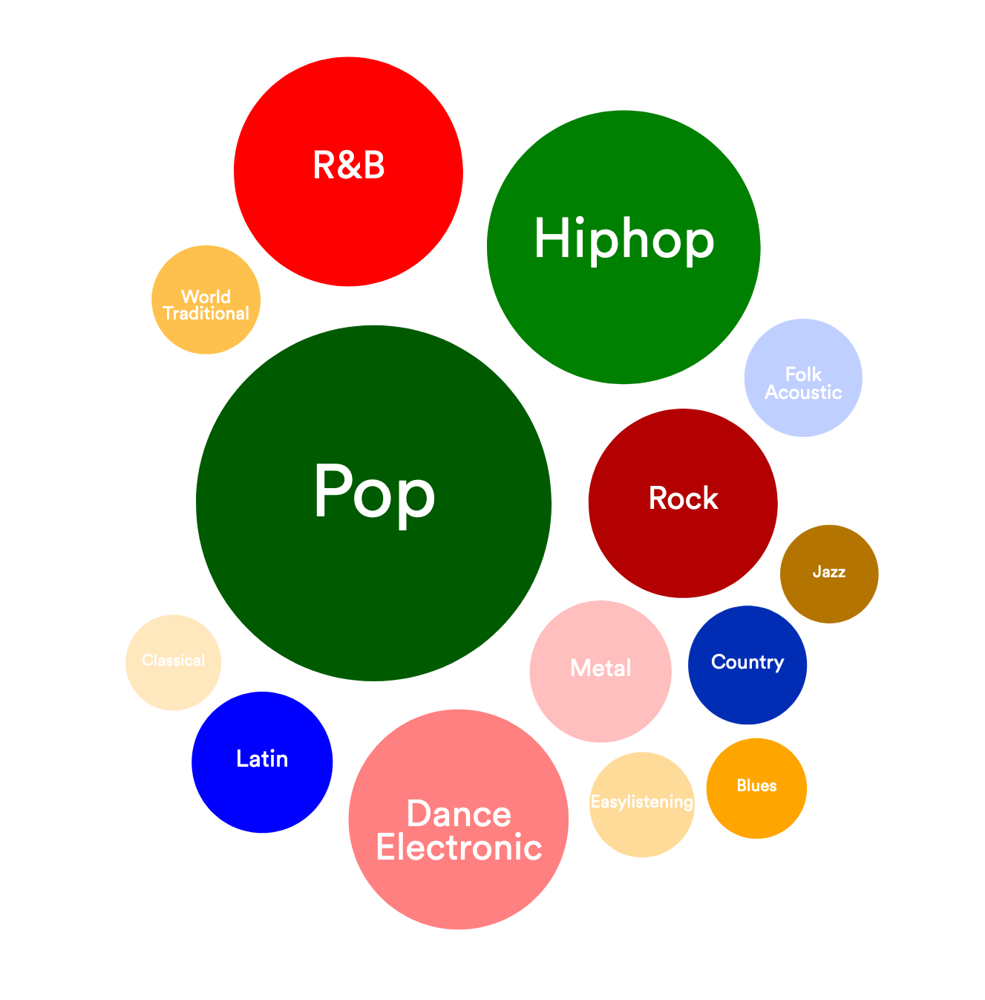

Alden-Anthony-Luke-Zeng
---
Actually it's just Luke and Zeng now, but we left the repo name unchanged for the grader's ease. Because of two of our group-mates dropping the class, Dr. Bryan permit us to create only 3 visualizations, and an innovative view.

### Overview
This website tells a story about the most popular hit music over the two decades from 2000 to 2019. It accomplishes this using data collected from Spotify, where each of the top tracks are described with thirteen key attributes. Our story informs the user regarding how the genres of music that are the most popular have shifted over the last twenty years, and the trend in song attributes that characterizes that change.

### Data Description
The dataset, while mostly complete, had some errors that had to be filtered out. For instance, some songs from 1998 and 1999 appeared on the list, even though the dataset was designed to begin with songs from 2000 onwards. Additionally, the API used to make the dataset was unable to find genre definitions for some obscure songs, leaving with a default value. These songs were removed.
[View Dataset on Kaggle](https://www.kaggle.com/datasets/paradisejoy/top-hits-spotify-from-20002019)

| Attributes       | Type                   | Cardinality      | Special Properties     |
|------------------|------------------------|------------------|------------------------|
| Artist           | Categorical            | 835 artists      | None                   |
| Song             | Categorical            | 1879 songs       | None                   |
| Duration_ms      | Ordered (Quantitative) | 113000 to 484146 | Linear from Min to Max |
| Explicit         | Categorical            | True or False    | None                   |
| Year             | Ordered (Quantitative) | 1998 to 2020     | Linear from Min to Max |
| Popularity       | Ordered (Quantitative) | 0 to 89          | Linear from Min to Max |
| Danceability     | Ordered (Quantitative) | 0.13 to 0.97     | Linear from Min to Max |
| Energy           | Ordered (Quantitative) | 0.05 to 1        | Linear from Min to Max |
| Key              | Ordered (Quantitative) | 0 to 11          | Linear from Min to Max |
| Loudness         | Ordered (Quantitative) | -20.5 to -0.28   | Linear from Min to Max |
| Mode             | Categorical            | 0 or 1           | None                   |
| Speechiness      | Ordered (Quantitative) | 0.02 to 0.58     | Linear from Min to Max |
| Acousticness     | Ordered (Quantitative) | 0 to 0.98        | Linear from Min to Max |
| Instrumentalness | Ordered (Quantitative) | 0.13 to 0.98     | Linear from Min to Max |
| Liveness         | Ordered (Quantitative) | 0.02 to 0.85     | Linear from Min to Max |
| Valence          | Ordered (Quantitative) | 0.04 to 0.97     | Linear from Min to Max |
| Tempo            | Ordered (Quantitative) | 60 to 211        | Linear from Min to Max |
| Genre            | Categorical            | 59 genre(s)      | None                   |

### Goals and Tasks
Due to the many visualizations project has, there are several sub-tasks a user can perform, with the overarching task being the ability to discover and compare trends of Spotify’s top hits/genres over the past two decades. However, the user can also derive new trends (and discover attribute correlations) of how different genres build upon aspects such as energy, loudness, liveness, and valence by looking at the songs that fall within a genre the user “builds” by using our innovative view.

### Idioms
In total, we have three "traditional" visualizations, and one innovative view. Each visualization is presented on the right side of the screen, while information pertaining to the view is on the left side of the screen. As the user scrolls, each information blurb activates the next transition for that particular view. At the end of the visualization, a banner recaps the information presented, and previews the information that will be in the next section.

The first of these traditional views is a circle packing chart. Each genre correlates with a circle, where the size of the circle indicates the number of songs tagged with that genre. Additionally, the circles are colored with four colors with varying saturation levels. These colors indicate the "steps" the user takes while scrolling (where each "step" introduces a new set of circles), and also represent the popularity level of each genre. For example, all green genres are most popular, while all orange genres are relatively rare. Hovering over any of these circle provides a tooltip indicating the number of songs with that genre tagged.

The second

### Reflection

### Team Workload