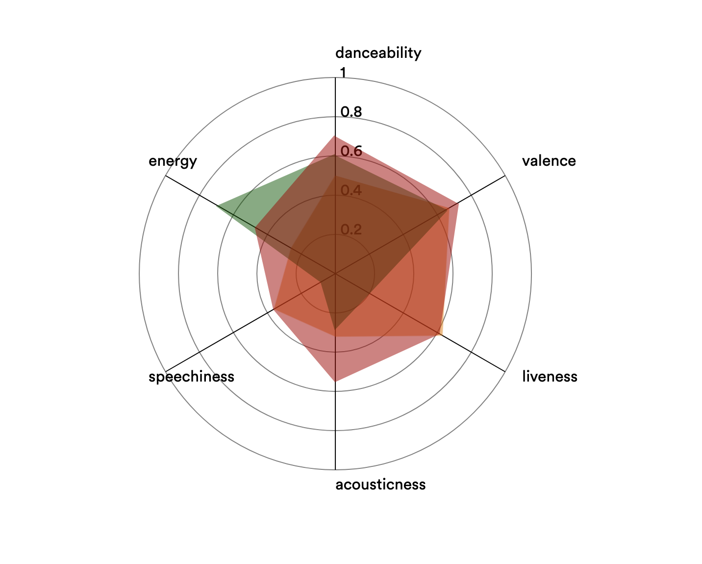

Alden-Anthony-Luke-Zeng
---
Actually it's just Luke and Zeng now, but we left the repo name unchanged for the grader's ease. Because of two of our group-mates dropping the class, Dr. Bryan permit us to create only 3 visualizations, and an innovative view.

### Overview

This website tells a story about the most popular hit music over the two decades from 2000 to 2019. It accomplishes this using data collected from Spotify, where each of the top tracks are described with thirteen key attributes. Our story informs the user regarding how the genres of music that are the most popular have shifted over the last twenty years, and the trend in song attributes that characterizes that change.

### Data Description
The dataset, while mostly complete, had some errors that had to be filtered out. For instance, some songs from 1998 and 1999 appeared on the list, even though the dataset was designed to begin with songs from 2000 onwards. Additionally, the API used to make the dataset was unable to find genre definitions for some obscure songs, leaving with a default value. These songs were removed.
[View Dataset on Kaggle](https://www.kaggle.com/datasets/paradisejoy/top-hits-spotify-from-20002019)

| Attributes       | Type                   | Cardinality      | Special Properties     |
|------------------|------------------------|------------------|------------------------|
| Artist           | Categorical            | 835 artists      | None                   |
| Song             | Categorical            | 1879 songs       | None                   |
| Duration_ms      | Ordered (Quantitative) | 113000 to 484146 | Linear from Min to Max |
| Explicit         | Categorical            | True or False    | None                   |
| Year             | Ordered (Quantitative) | 1998 to 2020     | Linear from Min to Max |
| Popularity       | Ordered (Quantitative) | 0 to 89          | Linear from Min to Max |
| Danceability     | Ordered (Quantitative) | 0.13 to 0.97     | Linear from Min to Max |
| Energy           | Ordered (Quantitative) | 0.05 to 1        | Linear from Min to Max |
| Key              | Ordered (Quantitative) | 0 to 11          | Linear from Min to Max |
| Loudness         | Ordered (Quantitative) | -20.5 to -0.28   | Linear from Min to Max |
| Mode             | Categorical            | 0 or 1           | None                   |
| Speechiness      | Ordered (Quantitative) | 0.02 to 0.58     | Linear from Min to Max |
| Acousticness     | Ordered (Quantitative) | 0 to 0.98        | Linear from Min to Max |
| Instrumentalness | Ordered (Quantitative) | 0.13 to 0.98     | Linear from Min to Max |
| Liveness         | Ordered (Quantitative) | 0.02 to 0.85     | Linear from Min to Max |
| Valence          | Ordered (Quantitative) | 0.04 to 0.97     | Linear from Min to Max |
| Tempo            | Ordered (Quantitative) | 60 to 211        | Linear from Min to Max |
| Genre            | Categorical            | 59 genre(s)      | None                   |

### Goals and Tasks
Due to the many visualizations project has, there are several sub-tasks a user can perform, with the overarching task being the ability to discover and compare trends of Spotify’s top hits/genres over the past two decades. However, the user can also derive new trends (and discover attribute correlations) of how different genres build upon aspects such as energy, loudness, liveness, and valence by looking at the songs that fall within a genre the user “builds” by using our innovative view.

### Idioms
In total, we have three "traditional" visualizations, and one innovative view. Each visualization is presented on the right side of the screen, while information pertaining to the view is on the left side of the screen. As the user scrolls, each information blurb activates the next transition for that particular view. At the end of the visualization, a banner recaps the information presented, and previews the information that will be in the next section.

The first of these traditional views is a circle packing chart. Each genre correlates with a circle, where the size of the circle indicates the number of songs tagged with that genre. Additionally, the circles are colored with four colors with varying saturation levels. These colors indicate the "steps" the user takes while scrolling (where each "step" introduces a new set of circles), and also represent the popularity level of each genre. For example, all green genres are most popular, while all orange genres are relatively rare. Hovering over any of these circle provides a tooltip indicating the number of songs with that genre tagged.

The second view is a stacked bar chart indicating the number of songs with each genre for each year. This visualization follows the same color scheme as above, with each genre carrying over the same color for consistency. As with before, these genres are drawn in steps as the user scrolls in order to best convey the story. However, when hovering over a particular bar, the user is presented with the genre's song count for that particular year, along with the name of the genre. 

The third visualization is a donut chart indicating the number of songs tagged with multiple genres. For instance, a song may not fit perfectly into one genre, and may be tagged with multiple, such as pop _and_ hiphop. Each slice is an indicator of the number of songs with one, two, three, and four genres, respectively. When hovering, the user is presented with the number of songs tagged with that number of genres. Once more, when scrolling, each arc is drawn one-by-one.

The innovative view, is a multipurpose radar/spider chart. When first presented, the user is able to compare the top two genres, pop and hiphop, with any genre of their choosing. However, this is not the innovative aspect. At the very end of the site, the user is able to reverse the process, and draw their own genre based on these attributes. The user is then presented with the closest matching song and genre to the genre they "created," and is able to see their respective spider charts overlaid.

Each of these visualizations required distinct algorithms to sort the data. The circle packing chart required a relatively simple algorithm of sorting purely on the most prominent (which is the first tagged) genre. This algorithm was slightly expanded for the stacked bar chart, which further sorted these genres into years. The donut chart, however, used a unique algorithm to count the number of genres each song was tagged with, and sort. 

For the innovative view, we averaged each genre's song's attributes for displaying. In order to calculate the closest matching genre and song, we calculated the margin of error for each attribute and summed these errors to calculate the overall margin of error. The song and genre with the lowest margin of error is considered the closest.

### Reflection
As roughly spoken about during the intro, two of our group mates dropped the course right before the WIP. Because of this, our project was required to change quite a bit. Due to the change in expectations in regard to the number of visualizations, we had to ensure our project was still a story with the fewer data points. Effectively, since our initial proposal, we had to rework every aspect of our project, aside from the dataset. This included the data encoded in our visualizations, in addition to the visualizations themselves. Also, due to the sudden drop of two of our group mates, we reworked our timeline as well, and hoped to get the project as close to done as possible, as quickly as possible. In essence, while our original proposal was feasible, the lack of manpower required the complete overhaul of the project to ensure a high-quality product. 

While working on our revised project, we were required to communicate quite effectively. However, regardless, we had some challenges when it came to merging our individual code chunks, such as reusing some variables, style conflicts, and layout incongruity. Due to this, we would start working in the team repo _immediately_ instead of working individually and merging code bases later.

### Team Workload

| Asset                                | Responsible Person |
|--------------------------------------|--------------------|
| Scrollytelling Research              | Zeng & Luke        |
| Design & Consistency                 | Zeng & Luke        |
| Functional Layout Design             | Zeng               |
| Initial Code Merging                 | Luke               |
| Circle Packing Chart                 | Zeng               |
| Stacked Bar Chart                    | Zeng               |
| Donut Chart                          | Luke               |
| Radar/Spider Chart (Innovative View) | Luke               |
| Poster Design                        | Zeng               |
| Final Writeup                        | Zeng & Luke        |